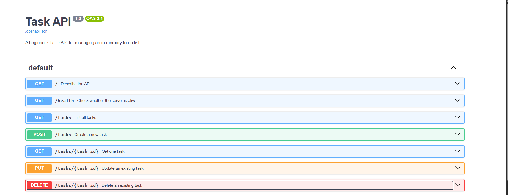

# Task API

Task API is a beginner CRUD API built with Python and FastAPI. It manages an in-memory to-do list and supports creating, reading, updating, and deleting tasks.

## Features

- Create tasks
- List all tasks
- Retrieve one task
- Update a task
- Delete a task
- Input validation
- JSON error responses
- Interactive Swagger UI documentation

## Technology

- Python 3.10+
- FastAPI
- Uvicorn
- Git and GitHub

## Installation

Clone the repository:

```powershell
git clone https://github.com/YOUR-USERNAME/task-api.git
cd task-api
```

Create and activate a virtual environment:

```powershell
python -m venv .venv
.\.venv\Scripts\Activate.ps1
```

Install dependencies:

```powershell
python -m pip install -r requirements.txt
```

## Run the API

```powershell
fastapi dev main.py
```

The API runs locally on:

```text
http://127.0.0.1:8000
```

Swagger UI is available at:

```text
http://127.0.0.1:8000/docs
```

## Endpoints

| Method | Endpoint | Description | Success code |
|---|---|---|---:|
| GET | `/` | Describe the API | 200 |
| GET | `/health` | Check server health | 200 |
| GET | `/tasks` | List all tasks | 200 |
| GET | `/tasks/{task_id}` | Retrieve one task | 200 |
| POST | `/tasks` | Create a task | 201 |
| PUT | `/tasks/{task_id}` | Update a task | 200 |
| DELETE | `/tasks/{task_id}` | Delete a task | 204 |

## Example request

```powershell
curl.exe -i -X POST http://127.0.0.1:8000/tasks -H "Content-Type: application/json" -d '{"title":"Buy milk"}'
```

## Example response

Paste your actual `curl -i` output here. Do not invent the output.

```text
PASTE YOUR ACTUAL CURL OUTPUT HERE
```

## Swagger UI



## In-memory storage

The tasks are stored in a Python list rather than a database. Any tasks created while the server is running are lost when the server restarts because the list is recreated from the original data in `main.py`.