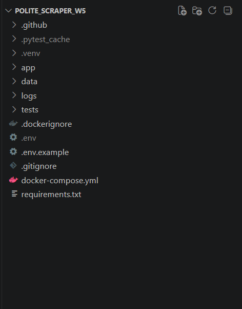
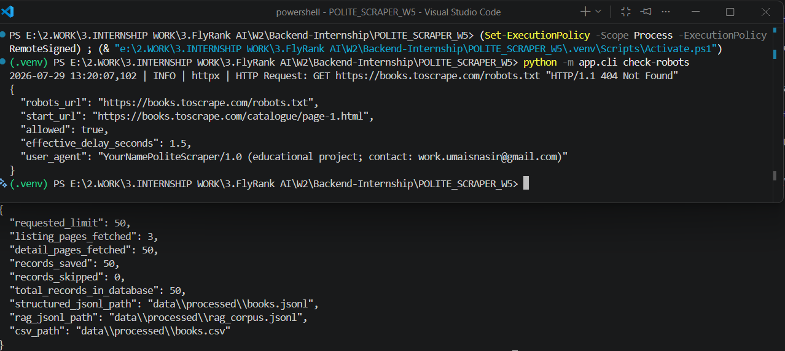
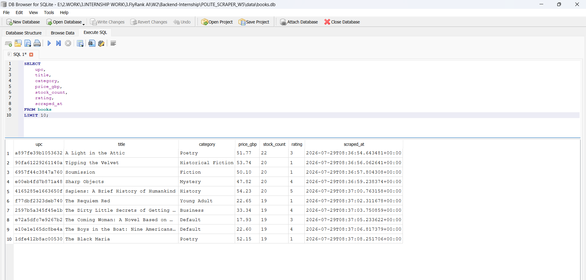
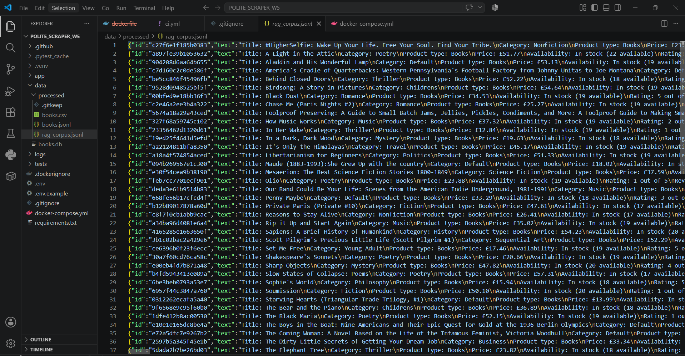
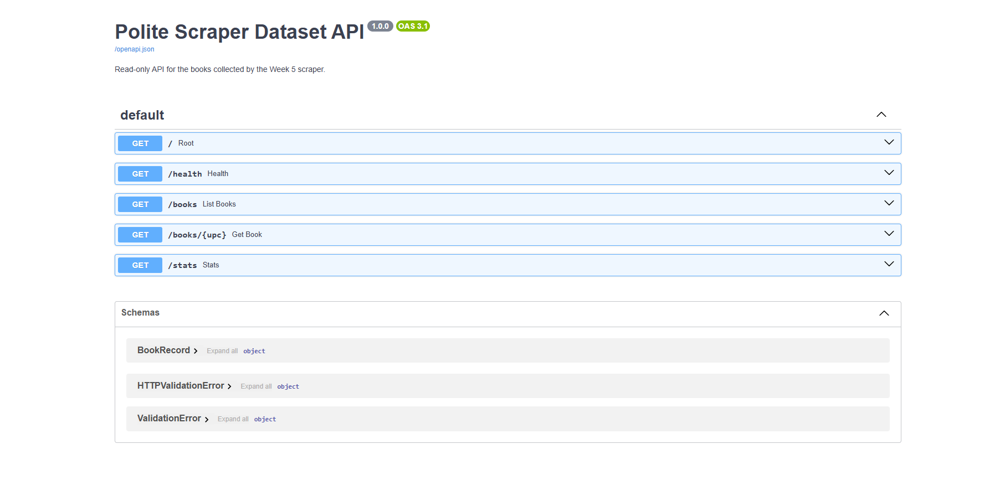
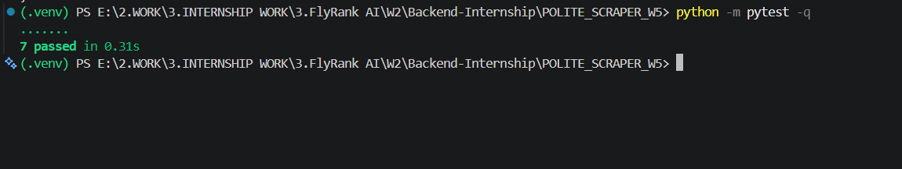

# Week 5 — The Polite Scraper

A robots-aware, rate-limited web scraper built for the Backend AI Engineering Week 5 assignment.

The project collects book data from the **Books to Scrape** sandbox website, extracts useful information, validates and cleans records using Pydantic models, stores structured data in SQLite, and generates JSONL, RAG-ready JSONL, and CSV datasets.

The scraper is designed with responsible crawling practices:

- robots.txt awareness
- request throttling
- descriptive User-Agent identification
- retry handling
- structured data validation
- safe domain restrictions

---

# Project Pipeline

```
Fetch URLs
    ↓
Robots Policy Check
    ↓
HTTP Client with Rate Limiting
    ↓
HTML Parsing
    ↓
Data Extraction
    ↓
Cleaning & Validation
    ↓
Pydantic BookRecord
    ↓
SQLite Storage
    ↓
Dataset Export
    ↓
FastAPI Read-only API
```

---

# Architecture

```
CLI
 |
 ↓
ScraperService
 |
 ↓
PoliteHttpClient
 |
 ├── RobotsPolicy
 |
 └── RateLimiter
 |
 ↓
HTML Parser
 |
 ↓
Pydantic Models
 |
 ↓
SQLite Repository
 |
 ├── JSONL Export
 ├── RAG JSONL Export
 └── CSV Export
```

FastAPI is used only as a **read-only dataset inspection layer**.

Scraping is executed through CLI commands.

---

# Features

## Responsible Scraping

The scraper:

- identifies itself using a descriptive User-Agent
- checks robots.txt before crawling
- validates whether URLs are allowed
- applies minimum request delays
- limits HTTP connections
- uses request timeouts
- retries temporary failures
- applies exponential backoff
- handles Retry-After headers
- prevents unsafe cross-domain crawling

---

# Tech Stack

## Backend

- Python 3.12
- FastAPI
- Uvicorn
- Pydantic
- HTTPX
- BeautifulSoup4

## Storage

- SQLite

## Testing

- Pytest

## Containerization

- Docker
- Docker Compose

---

# Project Structure

```
POLITE_SCRAPER_W5/

├── app/
│   ├── bootstrap.py
│   ├── cli.py
│   ├── config.py
│   ├── exceptions.py
│   ├── exporters.py
│   ├── http_client.py
│   ├── main.py
│   ├── models.py
│   ├── parser.py
│   ├── rate_limiter.py
│   ├── robots.py
│   ├── service.py
│   └── storage.py
│
├── data/
│   ├── books.db
│   └── processed/
│       ├── books.csv
│       ├── books.jsonl
│       └── rag_corpus.jsonl
│
├── tests/
│
├── Dockerfile
├── docker-compose.yml
├── requirements.txt
└── README.md
```

## Project Structure



---

# Setup

Create virtual environment:

```bash
py -m venv .venv
```

Activate environment:

Windows PowerShell:

```powershell
.venv\Scripts\Activate.ps1
```

Install dependencies:

```bash
python -m pip install -r requirements.txt
```

Create environment file:

```bash
cp .env.example .env
```

Update the scraper User-Agent contact information.

---

# Robots Check

Before scraping, robots policy can be checked:

```bash
python -m app.cli check-robots
```

Example result:

```
{
 "robots_url": "https://books.toscrape.com/robots.txt",
 "allowed": true,
 "effective_delay_seconds": 1.5
}
```

---

# Running the Scraper

Smoke test:

```bash
python -m app.cli scrape --max-books 3
```

Final scrape:

```bash
python -m app.cli scrape --max-books 50
```

Example execution:



Generated outputs:

```
data/books.db

data/processed/
├── books.jsonl
├── rag_corpus.jsonl
└── books.csv
```

---

# SQLite Database

The scraper stores validated book records in SQLite.

Database:

```
data/books.db
```

Example stored records:



The database uses UPC as the primary key.

Running the scraper again updates existing records instead of creating duplicates.

---

# Generated Structured Dataset

## JSONL Export

Each line contains one complete validated BookRecord.

Example:

```json
{
 "upc": "a897fe39b1053632",
 "title": "A Light in the Attic",
 "category": "Poetry",
 "price_gbp": "51.77",
 "stock_count": 22
}
```

---

# RAG Ready Dataset

The project generates a RAG-ready JSONL corpus for future Week 6 retrieval pipelines.

Format:

```json
{
"id":"unique-upc",
"text":"Natural language book description",
"metadata":{
    "category":"Travel",
    "price_gbp":"12.34",
    "source_url":"..."
 }
}
```

Generated file:

```
data/processed/rag_corpus.jsonl
```

Example:



---

# Dataset Statistics

View dataset statistics:

```bash
python -m app.cli stats
```

Rebuild exports:

```bash
python -m app.cli export
```

---

# FastAPI Dataset API

Start API:

```bash
python -m uvicorn app.main:app --reload
```

Available routes:

```
GET /
GET /health
GET /books
GET /books/{upc}
GET /stats
```

Swagger documentation:

```
http://127.0.0.1:8000/docs
```

API Documentation:



---

# Testing

Run tests:

```bash
python -m pytest -q
```

Result:

```
7 passed
```

Test coverage includes:

- parser validation
- robots handling
- SQLite storage
- exporters
- scraper workflow



---

# Docker

Make sure Docker Desktop is running.

Build image:

```bash
docker compose build
```

Run tests inside Docker:

```bash
docker compose run --rm polite-scraper-api python -m pytest -q
```

Run scraper inside Docker:

```bash
docker compose run --rm polite-scraper-api python -m app.cli scrape --max-books 30
```

Start API container:

```bash
docker compose up -d
```

Check:

```bash
docker compose ps
```

Logs:

```bash
docker compose logs polite-scraper-api
```

Stop:

```bash
docker compose down
```

---

# Idempotency

Books use UPC as the unique identifier.

Running the scraper multiple times:

- updates existing records
- avoids duplicate database entries
- keeps dataset consistent

---

# Ethical Scope

This project is limited to the configured educational practice website.

It does not:

- bypass authentication
- solve CAPTCHAs
- bypass access restrictions
- ignore robots rules
- avoid rate limits
- scrape unauthorized websites

The scraper follows responsible automated data collection practices.