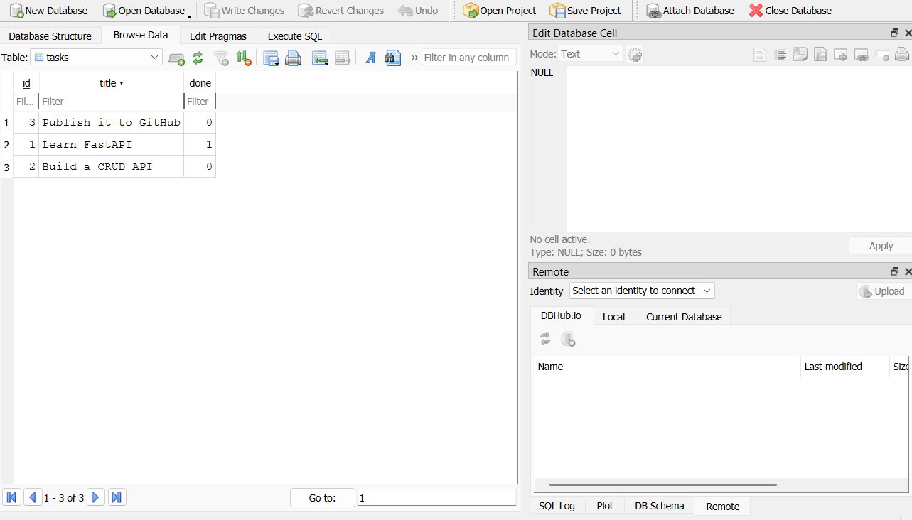

# Task API — SQLite

A FastAPI CRUD application for creating, reading, updating, and deleting tasks. The application stores tasks in a SQLite database so that data remains available after the API server is restarted.

## Project Overview

This project continues the earlier in-memory Task API assignment.

In the previous version, tasks were stored in a Python list. That meant all tasks disappeared whenever the server stopped or restarted.

In this version, the API endpoints and request formats remain the same, but the storage layer has been replaced with SQLite. Tasks are now stored in a database file and survive application restarts.

The project follows a layered architecture so that the API and business logic do not depend directly on SQLite.

## Why SQLite Was Chosen

SQLite was selected because it:

- Requires no separate database server
- Is included with Python through the built-in `sqlite3` module
- Stores the complete database in a single file
- Is easy to set up and use for learning SQL
- Is suitable for small applications and local development
- Allows data to persist after the API server restarts

Unlike PostgreSQL or MySQL, SQLite does not require a separate service, username, password, port, or Docker container.

## Architecture

The application uses the following flow:

```text
Client
  ↓
FastAPI Routes
  ↓
TaskService
  ↓
TaskRepository Interface
  ↓
SQLiteTaskRepository
  ↓
tasks.db
```

### Layer Responsibilities

- **FastAPI routes** receive HTTP requests and return HTTP responses.
- **TaskService** contains task-related business logic and validation.
- **TaskRepository** defines the storage operations required by the service.
- **SQLiteTaskRepository** implements those operations using SQL queries.
- **tasks.db** stores the task records permanently.

This separation allows the storage implementation to change without changing the API endpoints.

## Project Structure

```text
SQLITE_W3_A1/
├── app/
│   ├── repositories/
│   │   ├── __init__.py
│   │   ├── base.py
│   │   └── sqlite.py
│   ├── __init__.py
│   ├── main.py
│   ├── models.py
│   └── service.py
├── docs/
│   └── database-viewer.png
├── sql/
│   └── exploration.sql
├── .gitignore
├── README.md
├── requirements.txt
└── tasks.db
```

The `tasks.db` file is generated automatically when the application starts. It is normally excluded from Git because every user cloning the project should be able to generate their own database.

## Database Schema

The application creates a table named `tasks` with the following columns:

| Column | Type | Description |
|---|---|---|
| `id` | Integer | Primary key generated automatically |
| `title` | Text | Task title; cannot be empty |
| `done` | Integer/Boolean | `0` means incomplete and `1` means completed |

The equivalent SQL structure is:

```sql
CREATE TABLE IF NOT EXISTS tasks (
    id INTEGER PRIMARY KEY,
    title TEXT NOT NULL
        CHECK (TRIM(title) <> ''),
    done INTEGER NOT NULL DEFAULT 0
        CHECK (done IN (0, 1))
);
```

## Database Location

The SQLite database is stored in:

```text
SQLITE_W3_A1/tasks.db
```

The file is created automatically during application startup if it does not already exist.

## Database Initialization

When the application starts, it performs the following operations:

1. Opens or creates `tasks.db`.
2. Creates the `tasks` table if it does not already exist.
3. Counts the existing tasks.
4. Inserts three example tasks only when the table is empty.

The example tasks are:

```text
Learn FastAPI
Build a CRUD API
Publish it to GitHub
```

Repeated server restarts do not create duplicate example tasks while the table contains data.

## Requirements

- Python 3.10 or later
- `pip`
- A terminal such as PowerShell, Command Prompt, or Git Bash

SQLite does not require a separate installation because Python includes the `sqlite3` module.

## Installation

### 1. Clone the repository

```bash
git clone https://github.com/umaisnasir/Backend-Internship.git
cd Backend-Internship/SQLITE_W3_A1
```

### 2. Create a virtual environment

On Windows:

```powershell
py -m venv .venv
```

### 3. Activate the virtual environment

Using PowerShell:

```powershell
.\.venv\Scripts\Activate.ps1
```

If PowerShell blocks the activation script, run:

```powershell
Set-ExecutionPolicy -Scope Process -ExecutionPolicy RemoteSigned
.\.venv\Scripts\Activate.ps1
```

### 4. Install the dependencies

```powershell
python -m pip install -r requirements.txt
```

## Running the Project

From inside the `SQLITE_W3_A1` directory, run:

```powershell
python -m uvicorn app.main:app --reload
```

The API will run at:

```text
http://127.0.0.1:8000
```

The interactive Swagger documentation is available at:

```text
http://127.0.0.1:8000/docs
```

The ReDoc documentation is available at:

```text
http://127.0.0.1:8000/redoc
```

> On this development machine, the `fastapi.exe` launcher was blocked by Windows Application Control. Running Uvicorn through Python avoids that launcher and starts the same FastAPI application successfully.

## API Endpoints

| Method | Endpoint | Description | Success status |
|---|---|---|---|
| `GET` | `/` | Return basic API information | `200 OK` |
| `GET` | `/health` | Confirm that the server is running | `200 OK` |
| `GET` | `/tasks` | Return all tasks | `200 OK` |
| `GET` | `/tasks/{task_id}` | Return one task by ID | `200 OK` |
| `POST` | `/tasks` | Create a new task | `201 Created` |
| `PUT` | `/tasks/{task_id}` | Update an existing task | `200 OK` |
| `DELETE` | `/tasks/{task_id}` | Delete an existing task | `204 No Content` |

## Example API Requests

### Get all tasks

```http
GET /tasks
```

Example response:

```json
[
  {
    "id": 1,
    "title": "Learn FastAPI",
    "done": true
  },
  {
    "id": 2,
    "title": "Build a CRUD API",
    "done": false
  },
  {
    "id": 3,
    "title": "Publish it to GitHub",
    "done": false
  }
]
```

### Get one task

```http
GET /tasks/1
```

Example response:

```json
{
  "id": 1,
  "title": "Learn FastAPI",
  "done": true
}
```

### Create a task

```http
POST /tasks
Content-Type: application/json
```

Request body:

```json
{
  "title": "Buy milk"
}
```

Example response:

```json
{
  "id": 4,
  "title": "Buy milk",
  "done": false
}
```

### Update a task

```http
PUT /tasks/4
Content-Type: application/json
```

Request body:

```json
{
  "title": "Buy milk and bread",
  "done": true
}
```

Example response:

```json
{
  "id": 4,
  "title": "Buy milk and bread",
  "done": true
}
```

### Delete a task

```http
DELETE /tasks/4
```

Successful deletion returns:

```text
204 No Content
```

## Validation and Error Handling

### Missing or blank title

A missing or blank task title returns:

```text
400 Bad Request
```

Example:

```json
{
  "error": "title must not be empty"
}
```

### Empty update body

An empty update request returns:

```text
400 Bad Request
```

Example:

```json
{
  "error": "Request body cannot be empty"
}
```

### Unknown task ID

Requesting, updating, or deleting a task that does not exist returns:

```text
404 Not Found
```

Example:

```json
{
  "error": "Task not found"
}
```

## SQL Queries Used

The application uses parameterized SQL queries for CRUD operations.

### List all tasks

```sql
SELECT id, title, done
FROM tasks
ORDER BY id;
```

### Get one task

```sql
SELECT id, title, done
FROM tasks
WHERE id = ?;
```

### Insert a task

```sql
INSERT INTO tasks (title, done)
VALUES (?, 0);
```

### Update a task

```sql
UPDATE tasks
SET title = ?, done = ?
WHERE id = ?;
```

### Delete a task

```sql
DELETE FROM tasks
WHERE id = ?;
```

The `?` symbols are SQL parameter placeholders. Values are passed separately instead of being inserted directly into SQL strings, which helps prevent SQL injection.

## Manual SQLite Exploration

The required SQL queries are stored in:

```text
sql/exploration.sql
```

The following queries were executed using DB Browser for SQLite.

### List every task

```sql
SELECT * FROM tasks;
```

### Show completed tasks

```sql
SELECT * FROM tasks
WHERE done = 1;
```

### Count all tasks

```sql
SELECT COUNT(*) AS total_tasks
FROM tasks;
```

### Mark every task as completed

```sql
UPDATE tasks
SET done = 1;
```

### Delete all completed tasks

```sql
DELETE FROM tasks
WHERE done = 1;
```

Changes made directly through DB Browser for SQLite were immediately visible through the API.

## Persistence Test

Database persistence was verified using the following process:

1. The API server was started.
2. A new task named `Buy milk` was created using `POST /tasks`.
3. The task was confirmed using `GET /tasks/4`.
4. The FastAPI server was stopped.
5. The server was started again.
6. `GET /tasks/4` was executed again.
7. The task was still present after the restart.

This confirms that tasks are stored in `tasks.db` rather than in temporary application memory.

## SQLite Database Viewer

The following screenshot shows the `tasks` table inside DB Browser for SQLite:



## Git Commit Stages

The assignment was completed using separate commits for each stage:

```text
Stage 0: create SQLite database
Stage 1: database read endpoints
Stage 2: insert into database
Stage 3: update and delete with SQL
Stage 4: explored SQLite
Stage 5: database documentation
```

## Technologies Used

- Python
- FastAPI
- Pydantic
- SQLite
- Python `sqlite3`
- Uvicorn
- DB Browser for SQLite
- Git
- GitHub