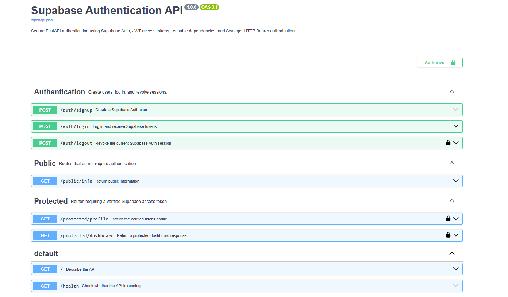

# Supabase Authentication API

A secure FastAPI authentication project using Supabase Auth for user registration, login, JWT verification, protected routes, session logout, and Swagger Bearer authorization.

## Features

- Email/password signup
- Email/password login
- Supabase JWT access tokens
- Refresh-token delivery
- Public and protected routes
- Reusable FastAPI authentication dependency
- Server-side token verification
- Supabase session logout
- Swagger HTTP Bearer authentication
- Consistent JSON errors
- Environment-based configuration

## Authentication flow

```text
Client
  ↓
POST /auth/login
  ↓
Supabase Auth verifies credentials
  ↓
Access token + refresh token
  ↓
Authorization: Bearer <access_token>
  ↓
FastAPI authentication dependency
  ↓
Supabase validates the token
  ↓
Protected route returns data
```

## Architecture

```text
FastAPI Routes
      ↓
Authentication Dependency
      ↓
Auth Service
      ↓
Stateless Supabase Client
      ↓
Supabase Auth
```

## Project structure

```text
SUPABASE_AUTH_W4/
├── app/
│   ├── dependencies/
│   │   ├── __init__.py
│   │   └── auth.py
│   ├── routers/
│   │   ├── __init__.py
│   │   ├── auth.py
│   │   ├── protected.py
│   │   └── public.py
│   ├── services/
│   │   ├── __init__.py
│   │   └── auth.py
│   ├── __init__.py
│   ├── config.py
│   ├── exceptions.py
│   ├── main.py
│   ├── models.py
│   └── supabase_client.py
├── docs/
│   └── swagger-auth.png
├── .env.example
├── .gitignore
├── README.md
└── requirements.txt
```

## Supabase setup

1. Create a Supabase project.
2. Open Authentication → Sign In / Providers → Email.
3. Enable the email provider.
4. Enable new-user signup.
5. For immediate assignment testing, disable Confirm email.
6. Copy the Project URL.
7. Copy the publishable project key.
8. Do not use a secret or service-role key.

## Environment variables

Copy the example file:

### PowerShell

```powershell
Copy-Item .env.example .env
```

### Git Bash

```bash
cp .env.example .env
```

Update `.env` locally:

```env
SUPABASE_URL=https://your-project-reference.supabase.co
SUPABASE_KEY=sb_publishable_your_key
```

Never commit `.env`.

## Installation

### Windows PowerShell

```powershell
py -m venv .venv
.\.venv\Scripts\Activate.ps1
python -m pip install -r requirements.txt
```

### Git Bash

```bash
py -m venv .venv
source .venv/Scripts/activate
python -m pip install -r requirements.txt
```

## Run the API

```bash
python -m uvicorn app.main:app --reload
```

Swagger UI:

```text
http://127.0.0.1:8000/docs
```

## Endpoints

| Method | Endpoint | Authentication | Success |
|---|---|---:|---:|
| GET | `/` | No | 200 |
| GET | `/health` | No | 200 |
| POST | `/auth/signup` | No | 201 |
| POST | `/auth/login` | No | 200 |
| POST | `/auth/logout` | Bearer token | 204 |
| GET | `/public/info` | No | 200 |
| GET | `/protected/profile` | Bearer token | 200 |
| GET | `/protected/dashboard` | Bearer token | 200 |

## Signup

Request:

```json
{
  "email": "your-real-email-address",
  "password": "a-secure-password"
}
```

Success:

```json
{
  "message": "User created successfully",
  "user": {
    "id": "user-uuid",
    "email": "your-real-email-address",
    "created_at": "timestamp"
  }
}
```

## Login

Request:

```json
{
  "email": "your-real-email-address",
  "password": "a-secure-password"
}
```

Success:

```json
{
  "access_token": "jwt",
  "refresh_token": "refresh-token",
  "token_type": "bearer"
}
```

Invalid credentials:

```json
{
  "error": "Invalid login credentials"
}
```

## Protected requests

```http
Authorization: Bearer <access_token>
```

Missing token:

```json
{
  "error": "Access token required"
}
```

Invalid token:

```json
{
  "error": "Invalid or expired token"
}
```

## Swagger authorization

1. Log in through `POST /auth/login`.
2. Copy the `access_token`.
3. Click **Authorize**.
4. Paste only the raw token.
5. Do not include the word `Bearer`.
6. Test the protected endpoints.



## Status codes

| Status | Meaning |
|---:|---|
| 200 | Successful request |
| 201 | User created |
| 204 | Logout completed |
| 400 | Invalid request body or weak credentials |
| 401 | Missing, invalid, or expired authentication |
| 409 | User already exists |
| 429 | Authentication rate limit |
| 502 | Upstream authentication provider error |
| 503 | Authentication verification temporarily unavailable |

## Security decisions

- Passwords are sent to Supabase Auth and are never stored by this API.
- The API never returns password information.
- The publishable key is loaded from `.env`.
- No service-role or secret key is required.
- The real `.env` file is excluded from Git.
- Access tokens are verified through Supabase before user identity is trusted.
- Tokens are sent through the Authorization header, never through URLs.
- A fresh stateless Supabase client prevents cross-request session leakage.
- Login errors do not reveal whether an email account exists.
- Swagger uses a standard HTTP Bearer security scheme.

## Logout limitation

Supabase logout revokes the session and refresh token. An already issued access-token JWT may remain valid until its expiry time. Clients should remove both access and refresh tokens locally after logout.

## Testing checklist

- [x] Valid signup returns 201
- [x] Missing signup fields return 400
- [x] Duplicate user returns 409
- [x] Valid login returns tokens
- [x] Invalid login returns 401
- [x] Public route works without a token
- [x] Protected routes reject missing tokens
- [x] Protected routes reject malformed tokens
- [x] Protected routes reject random tokens
- [x] Protected routes accept valid tokens
- [x] Logout returns 204
- [x] Swagger shows Authorize and lock icons

## Development stages

```text
Stage 0: set up FastAPI and Supabase client
Stage 1: add signup and login endpoints
Stage 2: add public and dashboard routes
Stage 3: verify bearer tokens for profile
Stage 4: reuse auth dependency and add logout
Stage 5: document bearer authentication in Swagger
Stage 6: add project documentation
```